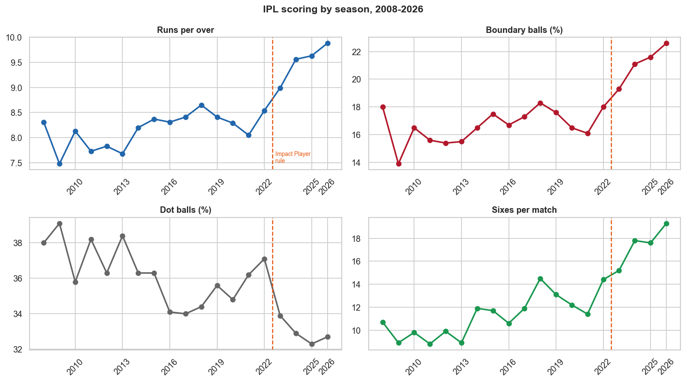
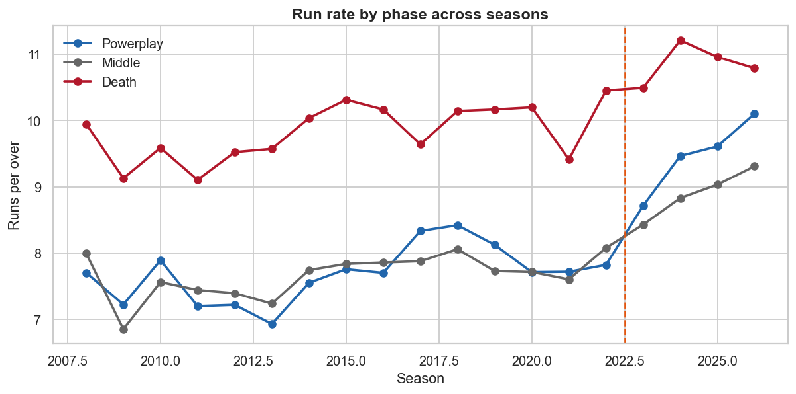
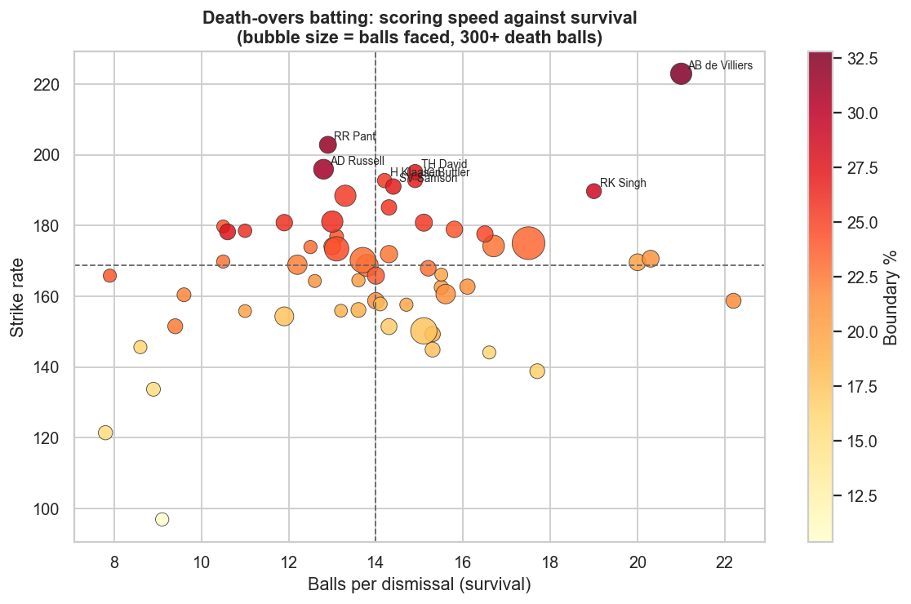
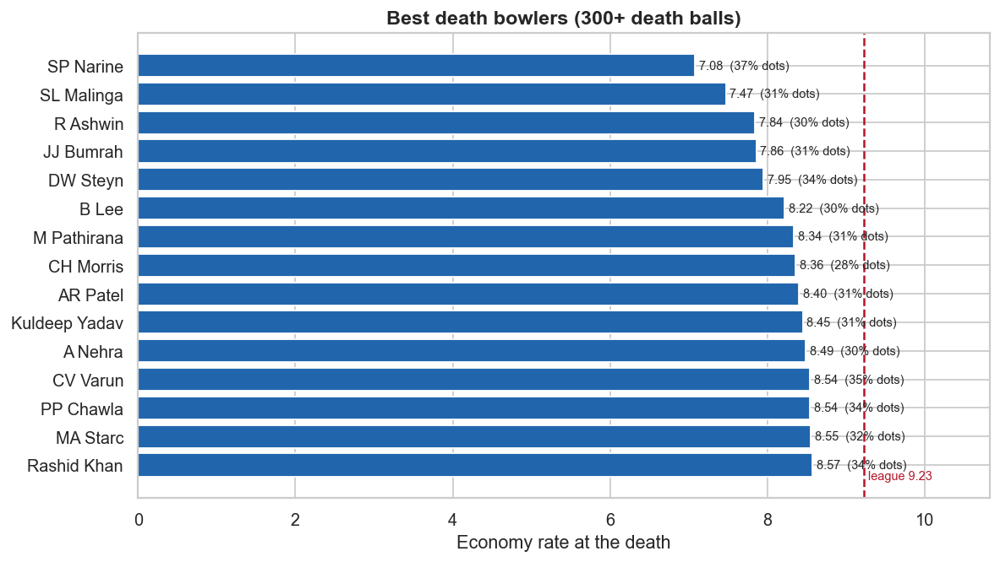
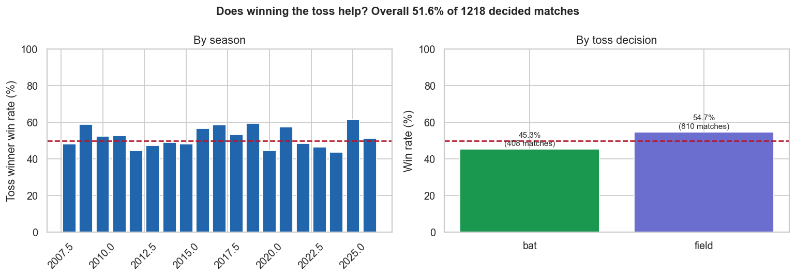

# IPL Ball-by-Ball Analytics — Findings

**Data.** 284,465 legal deliveries across 1,243 matches, IPL 2008–2026. Source: [Cricsheet](https://cricsheet.org) ball-by-ball archive.

**Scoring conventions.** These decide every rate in this report, so they are stated rather than assumed:

| Measure | Rule applied |
|---|---|
| Balls faced (batter) | Excludes wides, includes no-balls |
| Balls bowled (bowler) | Excludes wides and no-balls |
| Runs conceded (bowler) | Excludes byes and leg-byes |
| Wickets (bowler) | Excludes run-outs and retirements |
| Super overs | Excluded from all per-over statistics |

---

## 1. Scoring has risen, and the Impact Player rule is visible in it

|   season_year |   matches |   run_rate |   boundary_pct |   dot_pct |   sixes_per_match |
|--------------:|----------:|-----------:|---------------:|----------:|------------------:|
|          2008 |        58 |       8.31 |           18   |      38   |              10.7 |
|          2009 |        57 |       7.48 |           13.9 |      39.1 |               8.9 |
|          2010 |        60 |       8.13 |           16.5 |      35.8 |               9.8 |
|          2011 |        73 |       7.73 |           15.6 |      38.2 |               8.8 |
|          2012 |        74 |       7.83 |           15.4 |      36.3 |               9.9 |
|          2013 |        76 |       7.68 |           15.5 |      38.4 |               8.9 |
|          2014 |        60 |       8.2  |           16.5 |      36.3 |              11.9 |
|          2015 |        59 |       8.37 |           17.5 |      36.3 |              11.7 |
|          2016 |        60 |       8.31 |           16.7 |      34.1 |              10.6 |
|          2017 |        59 |       8.41 |           17.3 |      34   |              11.9 |
|          2018 |        60 |       8.65 |           18.3 |      34.4 |              14.5 |
|          2019 |        60 |       8.41 |           17.6 |      35.6 |              13.1 |
|          2020 |        60 |       8.29 |           16.5 |      34.8 |              12.2 |
|          2021 |        60 |       8.05 |           16.1 |      36.2 |              11.4 |
|          2022 |        74 |       8.54 |           18   |      37.1 |              14.4 |
|          2023 |        74 |       8.99 |           19.3 |      33.9 |              15.2 |
|          2024 |        71 |       9.56 |           21.1 |      32.9 |              17.8 |
|          2025 |        74 |       9.63 |           21.6 |      32.3 |              17.6 |
|          2026 |        74 |       9.88 |           22.6 |      32.7 |              19.3 |

Run rate averaged **8.39** across the five seasons before the Impact Player rule and **9.52** from 2023 onwards, a rise of **+1.13 runs per over**.

The rule lets a side substitute a player mid-match, which in practice means batting sides field an extra specialist batter and can bat deeper without carrying the risk that used to come with it. The timing of the jump is consistent with that, though a rule change is not the only thing that happened in 2023 — squad composition, pitch preparation and bat technology all move too. This is an association in a time series, not a controlled experiment.

## 2. The three phases are different games

| phase     |   balls |   run_rate |   boundary_pct |   dot_pct |   balls_per_wicket |
|:----------|--------:|-----------:|---------------:|----------:|-------------------:|
| Powerplay |   89153 |       8.09 |           20.4 |      46.3 |               24.9 |
| Middle    |  131526 |       7.95 |           14.3 |      31.8 |               23   |
| Death     |   63786 |      10.06 |           20.8 |      28.4 |               11.8 |

The death overs score **1.3x** as fast as the middle overs (10.06 against 7.95 runs per over) and cost a wicket every 11.8 balls against 23.0.

This is why any comparison of players has to be made **within** a phase. A batter with a strike rate of 140 is unremarkable at the death and outstanding in the powerplay, and a single career strike rate hides which of those a player actually is.

## 3. Where each batter is weakest

For every batter with 200+ balls in all three phases, the phase where their strike rate sits furthest below the **league average for that same phase**:

| batter           | phase     |   balls |   strike_rate |   league_sr |   sr_vs_league |   dot_pct |   balls_per_dismissal |
|:-----------------|:----------|--------:|--------------:|------------:|---------------:|----------:|----------------------:|
| S Badrinath      | Powerplay |     237 |          76.8 |       129   |          -52.2 |      61.2 |                  39.5 |
| MK Tiwary        | Powerplay |     230 |          97.4 |       129   |          -31.6 |      51.3 |                  23   |
| JP Duminy        | Powerplay |     239 |          98.3 |       129   |          -30.7 |      54   |                  39.8 |
| KD Karthik       | Powerplay |     402 |          98.5 |       129   |          -30.5 |      52.2 |                  40.2 |
| JH Kallis        | Middle    |    1012 |          98.5 |       128.5 |          -30   |      31.6 |                  32.6 |
| KS Williamson    | Powerplay |     477 |         100.4 |       129   |          -28.6 |      50.3 |                  34.1 |
| NV Ojha          | Death     |     294 |         139.8 |       168.3 |          -28.5 |      36.4 |                  10.9 |
| AT Rayudu        | Powerplay |     732 |         106.1 |       129   |          -22.9 |      50.4 |                  31.8 |
| Mandeep Singh    | Death     |     274 |         149.6 |       168.3 |          -18.7 |      22.3 |                  11   |
| WP Saha          | Middle    |     900 |         109.8 |       128.5 |          -18.7 |      30.4 |                  23.7 |
| MK Pandey        | Death     |     471 |         151.4 |       168.3 |          -16.9 |      23.1 |                  14.3 |
| SR Watson        | Powerplay |    1257 |         112.6 |       129   |          -16.4 |      51.9 |                  31.4 |
| SS Iyer          | Powerplay |     910 |         113.4 |       129   |          -15.6 |      47.6 |                  27.6 |
| DPMD Jayawardene | Middle    |     728 |         113   |       128.5 |          -15.5 |      33.1 |                  25.1 |
| Shubman Gill     | Death     |     304 |         155.9 |       168.3 |          -12.4 |      23   |                  13.2 |

The comparison is against the league in the same phase, not against the batter's own other phases. Everyone scores faster at the death, so a batter's death strike rate always beats their powerplay one — that tells you nothing. What matters is how they compare to what other batters manage in the same situation.

The `dot_pct` column is where most of the mechanism shows. Across all qualifying batter-phases, dot percentage correlates at **−0.44** with falling behind the league, against **−0.33** for survival (balls per dismissal). Strike rotation is the larger effect, but both are present — batters who fall behind tend to be playing more dot balls *and* getting out somewhat more often.

## 4. Death bowling, measured properly

| bowler        |   balls |   economy |   dot_pct |   boundary_pct |   strike_rate |
|:--------------|--------:|----------:|----------:|---------------:|--------------:|
| SP Narine     |    1105 |      7.08 |      37.4 |           12.8 |          13.2 |
| SL Malinga    |    1117 |      7.47 |      31.3 |           13.7 |          10.3 |
| R Ashwin      |     601 |      7.84 |      29.6 |           12.6 |          16.7 |
| JJ Bumrah     |    1423 |      7.86 |      31.2 |           15.1 |          14   |
| DW Steyn      |     634 |      7.95 |      34.4 |           16.9 |          12.7 |
| B Lee         |     311 |      8.22 |      29.6 |           16.1 |          31.1 |
| M Pathirana   |     402 |      8.34 |      31.3 |           17.4 |          12.2 |
| CH Morris     |     646 |      8.36 |      28.3 |           16.4 |          11.1 |
| AR Patel      |     382 |      8.4  |      30.9 |           16.5 |          17.4 |
| Kuldeep Yadav |     370 |      8.45 |      31.4 |           15.4 |          12.8 |
| A Nehra       |     527 |      8.49 |      30.4 |           17.3 |           9.8 |
| CV Varun      |     328 |      8.54 |      35.4 |           17.1 |          17.3 |
| PP Chawla     |     444 |      8.54 |      33.8 |           17.8 |          11.4 |
| MA Starc      |     357 |      8.55 |      31.7 |           18.2 |           9.6 |
| Rashid Khan   |     630 |      8.57 |      34.3 |           17.9 |          14.7 |

Economy here excludes byes and leg-byes, which the bowler did not concede, and excludes wides and no-balls from the denominator, which they did not legally bowl. Both corrections matter at the death, where wides are frequent.

## 5. Does winning the toss matter?

Across **1,218 decided matches**, the toss winner won **51.6%** of the time (628 wins).

| toss_decision   |   matches |   win_pct |
|:----------------|----------:|----------:|
| bat             |       408 |      45.3 |
| field           |       810 |      54.7 |

A binomial test against a fair coin gives **p = 0.289**, so simply winning the toss confers no advantage distinguishable from chance.

**But the decision made after the toss does matter.** Captains who chose to field won **54.7%** of the time across 810 matches; those who chose to bat won only **45.3%** across 408. A chi-square test on that split gives **p = 0.0025**, which is significant.

That is a gap of **9.4 percentage points**, and it is consistent with the standard explanation: evening dew makes the ball harder to grip in the second innings, so chasing is easier. Captains appear to know this — they chose to field in 67% of matches.

**The causal reading is not available from this table.** Captains do not choose at random: they field when conditions favour chasing and bat when they do not. Part of the gap is therefore the conditions that prompted the decision rather than the decision itself. What the data supports is that *the toss is not the interesting variable — the innings order is*, and the headline 51.6% conceals that entirely.

---

## Limitations

- **No ball-tracking data.** Cricsheet records outcomes, not line, length, pace or shot type. Statements about *why* a batter struggles in a phase are not supportable here — only that they do.
- **Bowling style is not in the data.** A spin-versus-pace weakness analysis would need a separate player-attributes source joined on name, which introduces its own matching errors.
- **Minimum-ball thresholds are judgement calls.** 200 balls per phase and 300 for the death charts trade sample size against coverage; different thresholds change who appears.
- **Nineteen seasons of rule and format changes.** Team counts, squad rules and playing conditions all vary across the period, so cross-era comparisons carry that caveat.